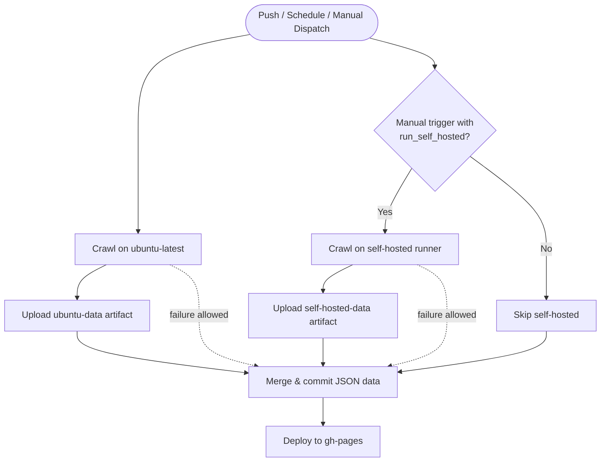

# Data Update Workflow

This document summarizes the GitHub Actions pipeline that refreshes the scraped datasets and publishes them to GitHub Pages.

## Job Sequence
- **crawl_ubuntu** – Runs scrapy spiders directly on `ubuntu-latest`, installs dependencies, and uploads the generated `data/` folder as the `ubuntu-data` artifact.
  - Runs announcement list spider first (nthu_announcements_list)
  - Then runs announcement item spider (nthu_announcements_item)
  - Finally runs other spiders (buses, courses, dining)
- **crawl_self_hosted** – Runs on the self-hosted runner, but only when manually triggered with `run_self_hosted` input set to true. Produces the `self-hosted-data` artifact.
  - Runs directory, maps, and newsletters spiders
- **commit_changes** – Always starts once both crawl jobs finish. It downloads whichever artifacts succeeded, merges them into `data/`, commits the changes once, and pushes to `main`.
- **deploy_to_github** – Regenerates the metadata files and deploys the refreshed `data/` directory to the `gh-pages` branch.

## Announcements Spider Architecture
The announcements spider has been split into two separate spiders:
- **nthu_announcements_list**: Recursively crawls and updates the announcements list from the directory. Creates/updates `announcements_list.json` with links to announcement pages.
- **nthu_announcements_item**: Reads `announcements_list.json` and crawls the actual announcement content. Creates/updates `announcements.json` with article details.

This separation allows for more efficient updates - normally only the item spider needs to run to update content.

## Bus Spider Updates
The bus spider has been refactored to support the new Nanda bus route format:
- Added support for `towardNandaInfo` (to Nanda campus)
- Added support for route lines (route1, route2)
- Added support for departure stop (`depStop`) field
- Improved code structure with utility modules

## Manual Triggers
- Regular schedule (every 2 hours) and pushes to main run only ubuntu crawlers
- Self-hosted crawlers must be manually triggered via workflow_dispatch with `run_self_hosted` set to true

## Failure Isolation
- Either crawl job may fail (for example, when the self-hosted runner is offline). The `commit_changes` job still runs because it uses `if: ${{ always() }}`.
- Only successful crawls contribute artifacts, so the merge step gracefully continues with whichever datasets are available.
- If both crawls fail, the workflow stops during `commit_changes` to avoid pushing stale data.

## Flow Diagram

