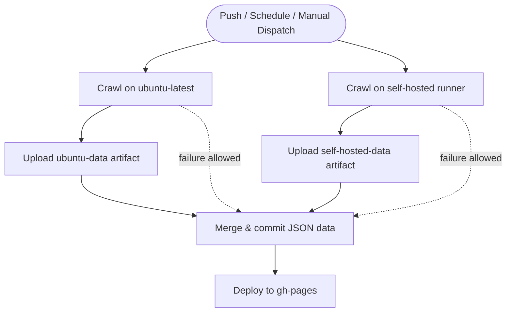

# Data Update Workflow

This document summarizes the GitHub Actions pipeline that refreshes the scraped datasets and publishes them to GitHub Pages.

## Job Sequence
- **crawl_ubuntu** – Runs `crawl.sh --group ubuntu` on `ubuntu-latest`, installs dependencies, and uploads the generated `data/` folder as the `ubuntu-data` artifact.
- **crawl_self_hosted** – Mirrors the ubuntu job on the self-hosted runner with `crawl.sh --group self-hosted`, producing the `self-hosted-data` artifact.
- **commit_changes** – Always starts once both crawl jobs finish. It downloads whichever artifacts succeeded, merges them into `data/`, commits the changes once, and pushes to `main`.
- **deploy_to_github** – Regenerates the metadata files and deploys the refreshed `data/` directory to the `gh-pages` branch.

## Failure Isolation
- Either crawl job may fail (for example, when the self-hosted runner is offline). The `commit_changes` job still runs because it uses `if: ${{ always() }}`.
- Only successful crawls contribute artifacts, so the merge step gracefully continues with whichever datasets are available.
- If both crawls fail, the workflow stops during `commit_changes` to avoid pushing stale data.

## Flow Diagram

